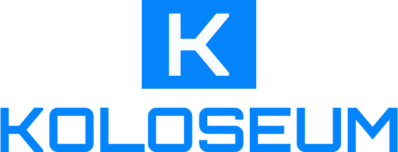

# Koloseum

Koloseum is **an online esports platform that connects players, gaming lounges, and esports fans.** It enables individuals to track sessions at their local gaming lounge, compete in tournaments across various games, and shop for tickets and merchandise. Gaming lounges can use the platform to manage operations, track sessions, organise competitions, and act as competitive esports clubs.

By streamlining offerings for players and lounges, Koloseum **boosts foot traffic, creates new revenue streams, and establishes lounges as key hubs in Kenya's esports ecosystem.**

 

    

## Our core purpose

Koloseum exists to redefine esports in Kenya by creating an inclusive platform that empowers gaming communities, fosters fair competition, and celebrates the unique gaming culture of the region. In doing this, we are committed to and driven by the following key principles:

### Kommunities

Koloseum **fosters vibrant connections among diverse gaming communities** through its distinct Markets:

-   **Ma Esto** for football enthusiasts
-   **Savanna FGC** for fighting game fans
-   **Hit List** (working title) for battle royale competitors

By offering tailored services such as Leagues, Challenges, and Locals, Koloseum addresses the unique needs of each community while creating opportunities for grassroots growth, camaraderie, and a unified sense of belonging in the Kenyan gaming scene.

### Kompetition

Koloseum **champions and advances the spirit of fair competition** by providing structured, accessible tournaments and events that enable players of all skill levels to showcase their abilities and grow their talents within the Koloseum ecosystem.

### Kulture

Koloseum **amplifies and markets a gaming culture that is uniquely Kenyan** by showcasing local talent, incorporating Kenyan traditions and narratives into esports storytelling, educating the general public about esports, and integrating it into the general consciousness. Koloseum seeks to inspire national pride and foster recognition of gaming as a legitimate cultural and professional pursuit in Kenya.

## Follow us

Check out our [Linktree](https://linktr.ee/koloseum.ke) for links to our social media pages and other relevant information.
